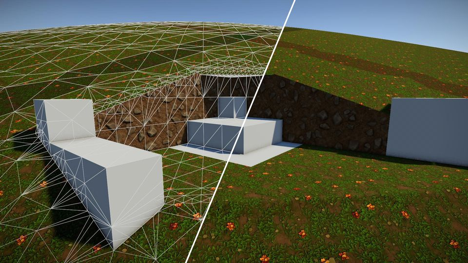

This project subdivides nodes where terrain and block meet and creates meshes using adaptive dual contouring.
Also, it uses LOD to render both terrain and blocks at a distance.

It uses jobs+burst, and also regular parallel processing. 

This is not optimized very well, but it will work.

  - Every time a chunk is updated or created, I generate and fill in the data for the chunk. No caching or reusing pre-calculated chunk data.
  - When checking if a node has a cube, sphere, or terrain intersection, I check every 8 corners for each node. Duplicate checks.
  - Placing down spheres was just for fun. Placing and processing spheres is NOT optimized in any way.

Used Unity 2022.3.61f1

https://www.youtube.com/watch?v=ZrhUb8OYSeY
